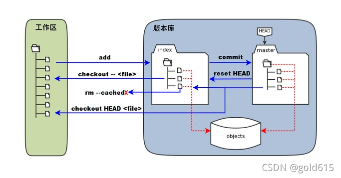
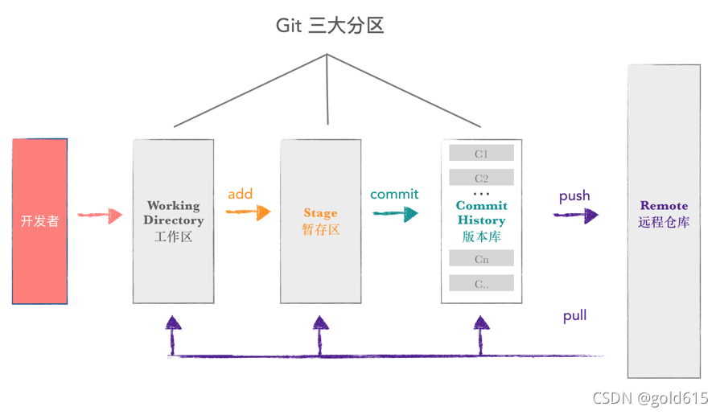

# kit-php
#### 使用PHP实现git的基本原理，实现的目标有以下几个：
* 支持基本的提交、推送、回滚、分支切换等功能
* 

## 1.0
### cmd
<ul>
<li>init</li>
<li>add</li>
<li>commit</li>
<li>push</li>
<li>pull</li>
<li>branch</li>
</ul>

### 组件
<ul>
<li>远程仓库服务器</li>
<li>本地仓库</li>
</ul>

### 版本库、暂存区、工作区

https://xie.infoq.cn/article/308a9fe53f0d7dc51283e4347
https://zhuanlan.zhihu.com/p/76634986
https://doc.yonyoucloud.com/doc/wiki/project/pro-git/git-internals.html
https://www.freecodecamp.org/chinese/news/git-internals-objects-branches-create-repo/
https://www.cnblogs.com/tanshaoshenghao/p/14200420.html
https://git-scm.com/book/zh/v2/Git-%E5%86%85%E9%83%A8%E5%8E%9F%E7%90%86-Git-%E5%AF%B9%E8%B1%A1
https://developer.aliyun.com/article/761663#slide-8
https://page.om.qq.com/page/Oa0cdfF_bPIPcyZNQ4-p-ryg0

https://blog.csdn.net/gold615/article/details/120123244
https://untitled.pw/software/1176.html

https://segmentfault.com/a/1190000041584963

https://blog.csdn.net/songyunzu/article/details/92023816

https://zhuanlan.zhihu.com/p/510150757

https://www.freesion.com/article/87471424159/

https://blog.csdn.net/Hoshizola/article/details/126436076

https://www.jianshu.com/p/786088387731

https://www.51cto.com/article/626663.html

https://www.cnblogs.com/liuyuelinfighting/p/16194504.html

https://www.modb.pro/db/215521

https://blog.csdn.net/u013155077/article/details/21401925